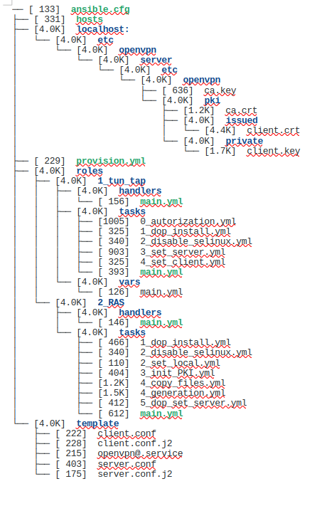

#### Описание домашнего задания
Настроить VPN между двумя ВМ в tun/tap режимах, замерить скорость в туннелях, сделать вывод об отличающихся показателях
Поднять RAS на базе OpenVPN с клиентскими сертификатами, подключиться с локальной машины на ВМ
---------------------------------------------------------------------------------
Playbook ansible имеет следующую структуру

Для выполнения работы с помощью Vagrant поднимаются две виртуальные машины на базе "ubuntu/jammy64":
- :server => {:net => ["192.168.56.3", 2, "255.255.255.0"],},
- :client=> {:net =>["192.168.56.4",  2, "255.255.255.0"],},
Тунели tun/tup создаются на базе пакета openvpn с помощью конфигурационных файлов:
  - [server.conf](https://github.com/vaslin1904/myOt2025/blob/main/work20VPN/ansible/template/server.conf.j2)
  - [client.conf](https://github.com/vaslin1904/myOt2025/blob/main/work20VPN/ansible/template/client.conf.j2)
Запуск тонеля происходит с помощью созданного systemctl service:
  [openvpn@.service](https://github.com/vaslin1904/myOt2025/blob/main/work20VPN/ansible/template/openvpn%40.service)
Замеряем  скорость с помощью команды на клиенте: **iperf3 -c 10.10.10.1 -t 40 -i 5**
И с помощью запуска на сервере **iperf3 -s &**
#### в тунеле **tap**

#### в тунеле **tun**

**TUN передал больше данных чем TAP и его пропускная способность была выше.**
TAP работает на втором уровне стека, что позволяет ему обрабатывать трафик, не основанный на IP. TAP также может использоваться для создания сетевого моста, так как операционная система рассматривает его как физическое Ethernet-устройство.
TUN, в свою очередь, работает на третьем уровне стека, на уровне IP. Он работает исключительно с пакетами сетевых протоколов (IPv4 и IPv6) и может использоваться только для маршрутизации, а не для создания сетевого моста.
______________________________________________________________________________________________
## RAS на базе OpenVPN 
Cистема, которая позволяет создавать виртуальную частную сеть (VPN) для удалённого доступа между клиентами и сервером. OpenVPN — свободная реализация технологии VPN с открытым исходным кодом, которая позволяет устанавливать соединения между компьютерами, находящимися за NAT и сетевым экраном, без изменения их настроек.
Проверка доступности с хоста сервера

Проверка на хостовой машине что сеть туннеля импортирована в таблицу маршрутизации командой **ip r (netstat -rn)**

